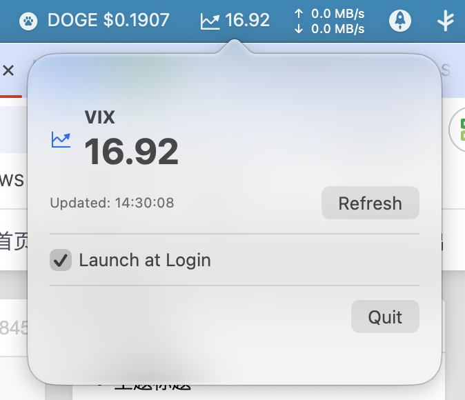

# VIXMenuBar

轻量、开源的 macOS 菜单栏应用，用于显示 VIX（恐慌指数）最新数值（数据来源：Yahoo Finance）。

> 在菜单栏展示最新 VIX 数值；点击图标可打开弹出面板查看详情（最新值、更新时间、手动刷新与退出）。

## 介绍与特性

- 菜单栏图标 + 实时数值显示
- 弹出面板展示最新数值与更新时间，支持手动刷新
- 自动周期拉取（默认 60 秒）

提示：本项目仅读取 Yahoo Finance 公开接口，不收集或上传任何用户隐私数据。

## 效果预览

## 环境要求

- macOS 12+（建议更高版本）
- Xcode 14+（Swift 5.7+）

## 安装与使用（普通用户）

将来发布到 GitHub Releases 后，普通用户可直接下载 `.dmg` 或 `.zip`。在此之前，你可以通过“从源码构建”自行使用。

首次启动后：
- 菜单栏会出现图标与数值。
- 默认每 60 秒自动刷新；也可在弹出面板中手动刷新。

登录时启动（Launch at Login）
- 从 macOS 13 起，应用通过系统提供的 ServiceManagement API 将自身添加到“系统设置 → 通用 → 登录项”。
- 第一次开启时，系统可能需要你的批准；若需要，会自动跳转到“登录项”页面，请在列表中允许该应用。
- 之后系统会在你登录 macOS 时自动启动本应用。

关于来自“未知开发者”的提示：
- 如果是未签名应用，macOS 可能会阻止启动；可在“系统设置 → 隐私与安全 → 仍要打开”放行，或使用 Finder 中“右键 → 打开”。
- 推荐后续使用开发者 ID 进行签名与公证，详见下文“打包与分发”。

## 从源码构建（开发者）

1) 打开项目
- 双击 `VIXMenuBar.xcodeproj` 或在 Xcode 中手动打开。

2) 选择运行目标
- Target：`VIXMenuBar`，运行目标为你的 My Mac。

3) 运行
- 点击 Run（⌘R）。首次运行会立即拉取一次数据并显示在菜单栏。

### 打包与分发（可选）

1. 签名与沙盒（App Sandbox）
   - 若在沙盒环境发布，需在 Signing & Capabilities 中启用 `App Sandbox`，并勾选 `Outgoing Connections (Client)`（`com.apple.security.network.client`）。
   - 使用 `SMAppService.mainApp` 无需额外的登录项辅助程序；建议使用开发者 ID 对应用进行签名以获得最佳用户体验。

2. 代码签名与公证（推荐）
   - 使用 Developer ID 对应用签名与公证（notarize），避免 Gatekeeper 阻止用户启动。
   - 参考 Apple 文档完成公证流程；签名示例命令请根据你的证书调整（可在 README 历史版本中查看样例）。

### 刷新间隔
- 默认 60 秒。若需修改，可在代码中调整对应常量（后续可加入 UI 配置）。

## 隐私与数据来源

- 仅访问 Yahoo Finance 公开接口（https://query1.finance.yahoo.com）获取行情数据；不采集、不上传任何本地用户数据。
- 若你扩展或更换数据源，请遵守相应服务的使用条款并在文档或应用内告知用户。

## 贡献与开发

欢迎 Issue / PR！

## 许可证

本项目采用 MIT 许可证发布。你可以自由地使用、修改和分发本软件。若将来在仓库中添加 `LICENSE` 文件，GitHub 将自动识别许可协议。

---
